# Book Club V3 — Intermediate Progress Report

**Status:** intermediate / proposal-grade, not paper-ready.
**Purpose:** consolidate what V3 demonstrated and what it did not, so the next
phase can be scoped against resource asks.

---

## 0. Glossary — every term used in this report

The system has a lot of moving parts. This table fixes vocabulary; nothing in
later sections introduces a new term without a definition there too.

| Term | Definition |
|---|---|
| **Story** | One of the 36 source historical-fiction passages. 12 counterfactual prompts ("cells") × 3 independent generations each = 36 stories. |
| **Cell** | One of 12 counterfactual prompts encoding 3 design axes — era × perspective × grounding. E.g. `cell-01-recent-sp-pure`. |
| **era** | When the counterfactual is set: `recent` (post-1900), `middle` (~1500–1900), `distant` (pre-1500). |
| **perspective** | Camera position: `sp` = single-point (one character's view); `sys` = systems (institutional / multi-character). |
| **grounding** | How real-world history is mixed in: `pure` = realistic counterfactual; `fantastical` = explicitly speculative element. |
| **Run** | `__run2`, `__run3` are independent re-generations of the same cell (sampling variance). The bare cell ID is run 1. |
| **Reader** | An LLM persona (deepseek-v4-flash, primed with a Goodreads-derived identity prompt) that reads a story and answers a probe. Not a human. |
| **Group A** | 10 LLM personas matched to "avid historical-fiction readers" on Goodreads (mean hf_frac ≈ 0.42). |
| **Group B** | 10 LLM personas matched to A on review length, analyticity, and book count, but with low HF reading (mean hf_frac ≈ 0.04). The contrast. |
| **Slot** | Which of the 2 sampled personas per (story, probe, group) — `agent-0` or `agent-1`. |
| **Probe** | An attentional frame given to the reader before they answer. 5 probes total: |
| **P1 Plausibility** | "What feels off historically?" Reader flags period mismatches, anachronism. *Priors-dependent.* |
| **P2 Knowledge-gap** | "What does the passage leave you wanting to know more about?" *Priors-dependent.* |
| **P3 Stability** | "Where does the writing call attention to itself?" Style/intrusion noticing. *Priors-independent intent; in practice it leaked.* |
| **P4 Convention** | "Where does this follow or depart from genre patterns?" *Priors-dependent.* |
| **P5 Salience** | "Which 2-3 passages should a fellow reader highlight?" *Priors-symmetric control.* |
| **pass1** | First reading: reader answers a generic question without the probe prime. |
| **pass2** | Second reading: same reader answers the probe-specific question. This is the "probed" response we code. |
| **Reader-attention coding** | LLM scoring (deepseek-v4-flash) of each pass2 response on 5 attention dimensions + a convention-type label. Codes the *reader*, not the story. |
| **period_specificity** | 0–5: how much specific period knowledge the reader brought to bear (dates, technologies, social/material facts). |
| **concreteness** | 0–5: vague impressions vs. named locatable observations. |
| **knowledge_invoked** | 0–5: how much outside knowledge the reader added beyond what the passage states. |
| **locations_cited** | int count: specific places in the passage the reader pointed at. |
| **anchors** | int count: concrete historical anchors (objects, terms, events) the reader named. |
| **convention_type** | {historical, generic-genre, mixed, none}: when the reader invoked genre/period conventions, what kind. |
| **Consolidator** | An LLM that reads N reader responses and produces a single editorial "directive" for a writer. Three prompt variants: |
| **NEUTRAL consolidator** | "Faithfully translate what readers noticed into what the author might change." No editorial opinion of its own. (V2's original.) |
| **SELECTIVE consolidator** | "Senior editor under CRAFT_GUIDE values" — names axes of reader disagreement, picks a side, refuses the other. References CRAFT_GUIDE vocabulary (period voice, anachronism, etc.) explicitly. |
| **SELECTIVE-BLIND consolidator** | Same machinery as SELECTIVE but with all CRAFT_GUIDE vocabulary stripped from the prompt. Editor "from your own judgment." A rubric-leak control. |
| **Directive** | The structured JSON output of a consolidator. Tells the writer what to change. Schema includes takeaways, overarching moves, inline edits, and (for SELECTIVE/BLIND) axes_of_divergence + a deliberate-set-aside list. |
| **Pooled scope** | Consolidator reads all 20 reader responses for one story at once (5 probes × 2 groups × 2 slots). |
| **Per-probe scope** | Consolidator reads only the readers for one probe at a time. Three sub-arms: |
| **A-only arm** | 2 group-A readers under one probe. |
| **B-only arm** | 2 group-B readers under one probe. |
| **AB-joint arm** | All 4 readers (2 A + 2 B) under one probe. |
| **Writer** | An LLM (deepseek-v4-flash, V1 writer prompt) that takes the original story + a directive and produces a revised story. |
| **Revised story** | Writer's output. 48 distinct revised versions per story (2 pooled + 1 pooled-blind + 45 per-probe = 5 probes × 3 arms × 3 variants), 1,728 total. |
| **Judge** | An LLM (deepseek-v4-flash, V1 judge prompt with CRAFT_GUIDE rubric embedded) that compares two stories blind and picks a winner. Used in V3 writer/judge harness; **explicitly not the focus of this report.** |
| **CRAFT_GUIDE** | A 20-marker rubric for historical-fiction craft (M-markers for general craft, H-markers for HF-specific, F-markers for failure modes). Loaded into the judge's system prompt; also referenced in the SELECTIVE consolidator's prompt. |
| **Rubric leak** | The methodological concern: if both the consolidator and the judge share CRAFT_GUIDE vocabulary, a SELECTIVE-consolidated revision may look "better" to the judge just because it matches the judge's vocabulary, not because it's actually better. SELECTIVE-BLIND was added to test this. |
| **Directive coding** | LLM scoring (this report) of each directive on 10 dimensions: editorial_commitment, specificity, takeaway_count, reader_attribution, probe_attribution, craft_vocab_count, edit_emphasis, conflict_acknowledged, conflict_resolution, note. |
| **editorial_commitment** | 0–5: how strongly the directive commits to a single direction vs. aggregates competing views. |
| **conflict_resolution** | {commit, aggregate, punt, none}: when readers disagreed, did the directive pick a side, keep both, defer to the writer, or not engage. |
| **craft_vocab_count** | int: count of CRAFT_GUIDE-aligned vocabulary occurrences in the directive (period voice, anachronism, implication, exposition, compression, counterfactual, specificity, sentence-level, earned). The rubric-leak indicator. |
| **edit_emphasis** | {cut, expand, voice_shift, structural, mixed, unclear}: the primary *kind* of revision the directive pushes. Coded in the schema above; aggregated in §3.6. |
| **invention_rate** | 0–1: of the distinct moves in a directive, the share supported by *no* reader note (consolidator-introduced). A relational coding (directive judged against the reader notes it saw). Validity check on whether commitment is grounded vs fabricated. §3.7. |
| **craft camp** | {period, generic, balanced, none}: which craft priority the directive sides with when it commits — `period` = historical accuracy / period voice (A-style); `generic` = pacing / structure / genre beats (B-style). A relational coding. §3.8. |

The "Directive coding" 10-dim schema is the in-isolation scoring; **invention_rate**
and **craft camp** are two additional *relational* codings (this session) that score
each directive against the reader notes it was built from
(`code_directive_extras.py`).

The two terms "Group A" / "Group B" are *informational labels* for analysis only —
during judge / consolidator work, group identity is randomized and blinded.

---

## 1. Executive summary

V3 ran a **3-stage Book Club pipeline** on 36 LLM-generated counterfactual
historical-fiction stories: (a) sample 20 LLM "readers" per story under 5
attentional probes, (b) consolidate reader responses into editorial directives
under 3 different consolidator prompts × 4 pooling strategies, (c) revise each
story 33 ways with an LLM writer.

This report addresses two questions, deliberately ignoring downstream
writer/judge comparisons (the LLM judge has no external ground truth and is
not yet a reliable arbiter — see §4):

1. **Do different Book Club configurations actually produce differentiated
   feedback?** Yes, decisively. Probe identity explains 11–32% of variance in
   reader attention dimensions (all p < 0.0001, 720 codings). The consolidator
   variant determines whether the directive *commits* to a direction or *punts*:
   pooled NEUTRAL is 14% commit / 47% punt; the default committing consolidator
   (SELECTIVE-BLIND) is 100% commit (1,728 directives). **SELECTIVE-BLIND is the
   default throughout this report** — it commits like the senior-editor prompt
   but carries no CRAFT_GUIDE vocabulary; plain SELECTIVE appears only in the
   leak comparison (point 2 / §3.5) and the SELECTIVE-specific §4.4 discussion.
2. **Is the committing consolidator's apparent quality lift a real editorial
   effect or rubric-vocabulary leak?** SELECTIVE-BLIND, which strips CRAFT_GUIDE
   vocabulary from the prompt, drops in-output craft vocab by 57% pooled (6.44 →
   2.78) and **81% per-probe** (5.92 → 1.12, both p=0.0002) but matches plain
   SELECTIVE on commitment, specificity, takeaway count, and conflict-resolution
   mix at both scopes. The editorial-commitment effect survives the strip; the
   vocabulary alignment was leaking — so we adopt SELECTIVE-BLIND as the default.
   Two further validity checks reinforce this: ~90% of the default's moves are
   grounded in real reader notes (invention rate ~10%, barely above NEUTRAL —
   §3.7), so its commitment is genuine rather than fabricated; separately, the
   rubric is shown to *tilt which craft camp* the editor sides with, not just the
   vocabulary (§3.8).

We also compiled the 1,728 revised stories into a downloadable dataset
(`run_20260531-022438/revisions_dataset/`, format mirrors the original 36-story
corpus). This is the main artifact deliverable from this session.

The central gap: **we have no external measure of revision quality.** The LLM
judge is calibrated against the same intuition (CRAFT_GUIDE) that wrote the
SELECTIVE consolidator, so judge-based wins are partly self-fulfilling. §6
costs three concrete asks (human raters, more compute, more personas) against
specific next-phase questions that resources would unlock.

---

## 2. What we built

| Layer | Object | Count | Where |
|---|---|---:|---|
| Source | counterfactual historical-fiction stories | 36 | `stories/<story_id>/story.txt` |
| Reader | LLM persona × story × probe × slot responses (pass1+pass2) | 720+720 = 1,440 | `results/<group>/<story_id>/<probe>/<agent>/{pass1,pass2}.txt` |
| Coding (reader) | attention codings on pass2 responses | 720 | `results/.../coding.json` (re-coded this session, 0 parse errors) |
| Consolidator | directives produced by 3 prompt variants × pooling strategies | 1,728 | `writer_judge_v3/`, `writer_judge_v3_blind/`, `revise_judge_byprobe_v3/` |
| Coding (directive) | structured 10-dim coding of each directive | 1,728 | `directive_codings/<scope>/<story_id>/<config>.json` |
| Coding (directive, relational) | invention rate + craft camp, each directive vs its reader inputs | 1,728 | `directive_extras_codings/...` (this session) |
| Writer | revised stories | 1,728 | `revisions_dataset/<story_id>/<config>.md` (compiled this session) |
| Judge | A/B paired comparisons (writer-judge harness) | ~700 | `writer_judge_v3*/*.json` (out of scope for this report) |

Per story, the experimental matrix now produces **49 artifacts**: 1 original +
48 revised versions (2 pooled + 1 pooled-blind + 45 per-probe = 5 probes × 3
arms × 3 variants). The per-probe SELECTIVE-BLIND variant (15/story, 540 total)
was added this session to extend the rubric-leak control from pooled to
per-probe scope (§3.5). The compiled revisions dataset has its own README at
`revisions_dataset/README.md`.

Total LLM calls in V3: ≈ 7,800 (reader passes + consolidator runs + writer
runs + judge runs + this session's coding extension: 540 per-probe blind
revisions, 540 base directive codings, 1,728 relational codings).

---

## 3. What worked

### 3.1 Probes drive reader attention substantially (C1 headline)

We re-coded all 720 pass2 reader responses (filling 5 missing slots and
re-parsing 78 parse-error stubs to 0 stubs remaining), then asked:
*does the probe identity explain variance in attention dimensions?*

A one-way permutation test (10,000 perms, shuffling probe labels and
measuring between-probe variance) is unambiguous:

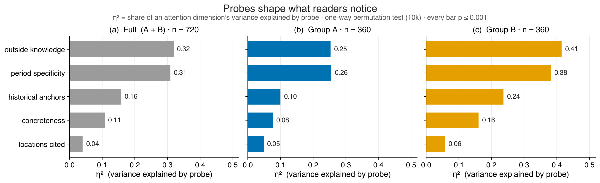

***Figure 1. Probes shape what readers notice.** η² is the share of an attention
dimension's variance explained by which probe the reader answered (one-way
permutation test, 10,000 shuffles of the probe label; every bar p ≤ 0.001).
**(a)** the full sample (A + B pooled,
n = 720); **(b)** Group A only (n = 360); **(c)** Group B only (n = 360) — all on
a shared scale, dimensions ordered by the full-sample η². The probe effect is
large for* outside knowledge *and* period specificity *(~0.3 overall) and — the
point of the split — it survives inside each group, so it is not an artifact of
group composition. It is in fact **stronger in Group B** (0.41 / 0.38) than Group
A (0.25 / 0.26): A's historical-fiction readers bring period attention fairly
regardless of probe (a high, probe-insensitive baseline — cf. Fig. 3), whereas
the controls' attention is moved more by the probe itself.*

| Dimension | η² | F-like | p |
|---|---:|---:|---:|
| period_specificity | 0.309 | 0.45 | 0.0001 |
| knowledge_invoked | 0.319 | 0.47 | 0.0001 |
| anchors | 0.158 | 0.19 | 0.0001 |
| concreteness | 0.108 | 0.12 | 0.0001 |
| locations_cited | 0.040 | 0.04 | 0.0001 |

Probe identity explains **~31% of the variance** in period_specificity and
knowledge_invoked — the most semantically interesting attention dimensions.
The probe-by-dim mean matrix (figure below) shows the structure: P3 Stability
and P5 Salience pull period_specificity and knowledge_invoked up; P4 Convention
sits in the middle; P1 Plausibility, P2 Knowledge-gap, P5 Salience differ on
locations_cited and anchors.

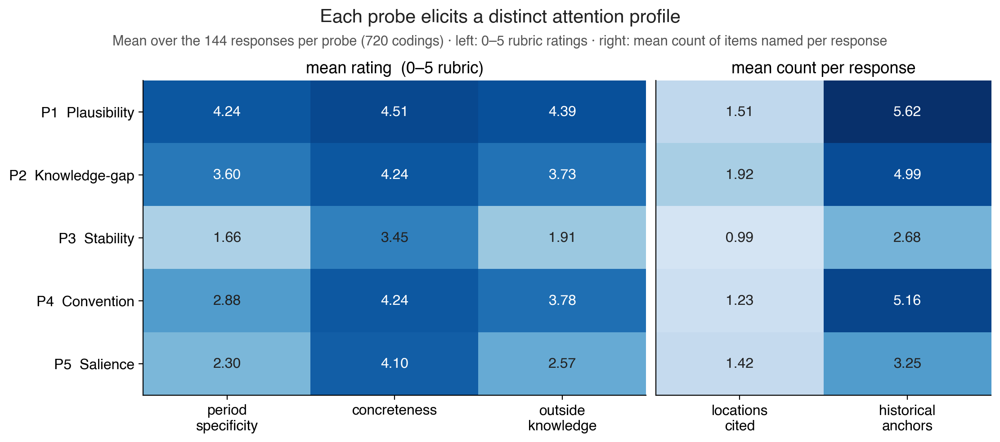

***Figure 2. Each probe elicits a distinct attention profile.** Each cell is the
mean over the 144 reader responses for that probe (720 total). The five
dimensions are **two different units**, shown in two panels: **left** = the mean
of a **0–5 rubric rating** (period specificity, concreteness, outside
knowledge); **right** = the mean **count of items named per response** (locations
cited = distinct passage locations the reader pointed to; historical anchors =
concrete period objects/terms/events named). So "P3 = 0.99 on locations cited"
means readers under the Stability probe pointed to **~1 specific location per
response on average** (often none) — not a 0.99-out-of-5 score; likewise
"anchors = 5.62" for P1 is a count, not a rating. Each panel has its own white
(low) → dark blue (high) scale. Reading across a row gives the probe's
signature: **P3 Stability is the coolest on every dimension** — it asks about
the prose, not the period — yet that is exactly the probe where the A-vs-B gap
appears (Fig. 3).*

This is the deepest result in this session. The reader pipeline is not
producing homogeneous boilerplate; the probes are doing real work of
differentiating what the reader attends to.

### 3.2 Group A vs B differentiation lives in P3 and P5

For the secondary axis — does the HF-reader (A) vs control (B) contrast
produce different attention, and is that contrast probe-dependent? — A-B gap
per (probe, dim) with 5,000-perm permutation:

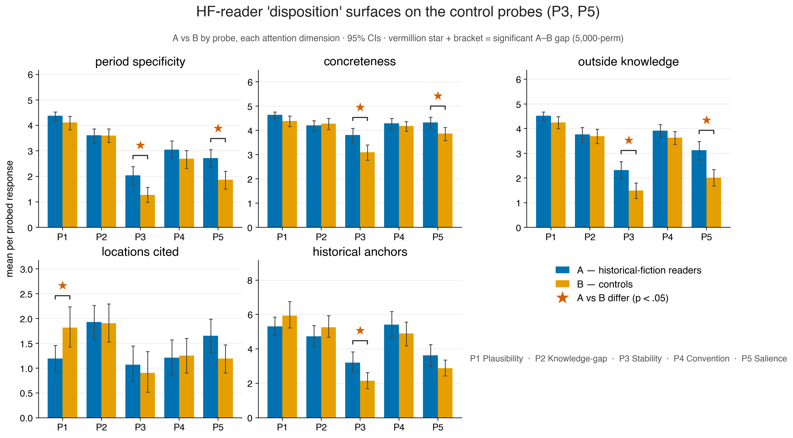

***Figure 3. HF-reader "disposition" surfaces on the control probes (P3, P5).**
Each panel is one attention dimension; within it, paired bars compare Group A
(historical-fiction readers, blue) and Group B (matched controls, orange) for
each of the five probes, with 95% confidence intervals. A vermillion ★ and
bracket flag the probe×dimension cells where the A–B gap is significant
(p < 0.05, 5,000-perm). The significant gaps cluster on **P3 Stability** (4 of 5
dimensions) and **P5 Salience** (3 of 5) — the two probes that never ask for
period knowledge — so A's historical-fiction priors bleed in even when the
prompt doesn't invite them. This is a disposition effect, not prompt-following.*

| Probe | Significant A-B gaps (p < 0.05, pass2) |
|---|---|
| P1 Plausibility | 1/5 (locations_cited, +B) |
| P2 Knowledge-gap | 0/5 |
| **P3 Stability** | **4/5** (period_specif +0.76, concrete +0.71, knowl_invoked +0.82, anchors +1.06; all p<0.01) |
| P4 Convention | 0/5 |
| **P5 Salience** | **3/5** (period_specif +0.85, concrete +0.46, knowl_invoked +1.11; p<0.01) |

P3 Stability and P5 Salience — the two probes designed to be priors-independent
and priors-symmetric respectively — are exactly where Group A (HF readers)
imports more period attention than Group B. Convention_type composition by
probe × group (chi² A-vs-B per probe) shows the same pattern: P3 chi²=18.96
p=0.0002, P5 chi²=20.90 p=0.0002, others n.s.

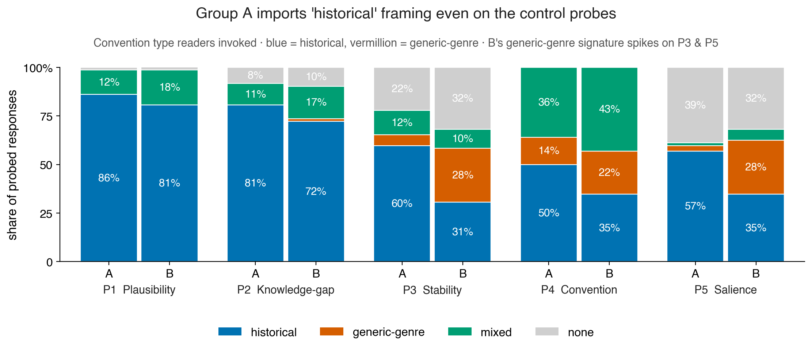

***Figure 4. Group A imports a "historical" reading frame even on the control
probes.** For each probe, two stacked bars (A, then B) give the share of pass-2
responses by the kind of convention the reader invoked — one label per response,
assigned by an LLM coder (deepseek-v4-flash) from the response text alone (not
the story): historical = period craft (blue), generic-genre = story craft
(vermillion), mixed (green), or none (grey); n = 72 per bar (36 stories × 2
slots). On the priors-forcing probes (P1,
P2) both groups are ~80% historical, leaving no room to differ. On the control
probes **P3 and P5, B's generic-genre share jumps to ~28% (vs A's ~3–6%)** while
A stays historical — the convention-frame signature of the same disposition
effect in Fig. 3 (A-vs-B χ²: P3 = 19.0, P5 = 20.9, both p = 0.0002; P1/P2/P4
n.s.). "generic-genre" is essentially a B-group tell that only surfaces where
the probe doesn't force a frame.*

The underlying counts (pass2; n=72 reader responses per probe×group cell =
36 stories × 2 slots), shown as **% (raw count)**, make the leak concrete
(source: `aggregated_differentiation/convention_by_probe_group_pass2.csv`):

| Probe | Group | `historical` | `generic-genre` | `mixed` | `none` |
|---|---|---:|---:|---:|---:|
| P1 Plausibility | A | 86% (62) | 0% (0) | 13% (9) | 1% (1) |
| P1 Plausibility | B | 81% (58) | 0% (0) | 18% (13) | 1% (1) |
| P2 Knowledge-gap | A | 81% (58) | 0% (0) | 11% (8) | 8% (6) |
| P2 Knowledge-gap | B | 72% (52) | 1% (1) | 17% (12) | 10% (7) |
| **P3 Stability** | **A** | **60% (43)** | **6% (4)** | **13% (9)** | **22% (16)** |
| **P3 Stability** | **B** | **31% (22)** | **28% (20)** | **10% (7)** | **32% (23)** |
| P4 Convention | A | 50% (36) | 14% (10) | 36% (26) | 0% (0) |
| P4 Convention | B | 35% (25) | 22% (16) | 43% (31) | 0% (0) |
| **P5 Salience** | **A** | **57% (41)** | **3% (2)** | **1% (1)** | **39% (28)** |
| **P5 Salience** | **B** | **35% (25)** | **28% (20)** | **6% (4)** | **32% (23)** |

Per-probe chi² of A-vs-B independence on `convention_type` (df=3; permutation
floor p=0.0002 = 1/5000; source `aggregated_differentiation/convention_chi2.csv`):

| Probe | χ² | p | A-vs-B differs? |
|---|---:|---:|---|
| P1 Plausibility | 0.86 | 0.73 | no |
| P2 Knowledge-gap | 2.20 | 0.55 | no |
| **P3 Stability** | **18.96** | **0.0002** | **yes** |
| P4 Convention | 3.81 | 0.16 | no |
| **P5 Salience** | **20.90** | **0.0002** | **yes** |
| across all 5 probes | 247.15 (df=12) | 0.0002 | yes |

The `generic-genre` column is the tell: it is essentially a B-group signature
that only surfaces on the unconstrained probes (P3: A=4 vs B=20; P5: A=2 vs
B=20). On P1/P2 both groups are near-saturated on `historical` (the probe
itself forces the frame, leaving no room for disposition to show); on P4 the
explicit Convention probe pushes everyone toward conventions and zeroes out
`none` for both groups. Only on the two "control" probes — where nothing in
the prompt forces a frame — does the reader's disposition fill the vacuum.

This confirms a finding from `REPORT_V3.md`: the "control" probes leak the
most. A's historical-fiction priors bleed in even when the probe doesn't
explicitly ask for them. **This is itself a finding worth keeping** — it
suggests A vs B differentiation is mostly a *disposition effect*, not a
prompt-following effect.

The across-5-probes contingency on convention_type (pooled groups) is
chi² = 247, df = 12, p < 0.0002 — strong probe-level differentiation in the
type of convention readers invoked.

### 3.3 Consolidator variant rewrites editorial intent (C2 headline)

We coded all **1,728 directives** (the original 1,188 plus the 540 per-probe
SELECTIVE-BLIND added this session) with a 10-dimension schema designed to
detect *how* a directive engages with reader disagreement. Throughout this
report **SELECTIVE-BLIND is the default committing consolidator** — it has the
full editorial-selection machinery but no CRAFT_GUIDE vocabulary, so it avoids
the rubric leak (§3.5); plain SELECTIVE is shown only where the leak itself is
the subject (§3.5) or where a SELECTIVE-specific downstream result is (§3.8 /
§4.4). Replacing NEUTRAL's faithful aggregation with the default editor
produces extreme differentiation:

| pooled (n=36 each) | editorial commitment | specificity | takeaways |
|---|---:|---:|---:|
| NEUTRAL | 3.58 | 3.78 | 4.44 |
| **SELECTIVE-BLIND** (default) | **5.00** | **4.97** | **6.81** |
| gap | −1.42 (p=0.0002) | −1.19 (p=0.0002) | −2.36 (p=0.0002) |

| per-probe (n=540 each) | editorial commitment | specificity | takeaways |
|---|---:|---:|---:|
| NEUTRAL | 3.74 | 3.21 | 3.40 |
| **SELECTIVE-BLIND** (default) | **5.00** | **4.80** | **6.76** |
| gap | −1.26 (p=0.0002) | −1.58 (p=0.0002) | −3.36 (p=0.0002) |

(The fourth coded dimension, CRAFT_GUIDE vocab, is the rubric-leak metric and
is treated separately in §3.5.)

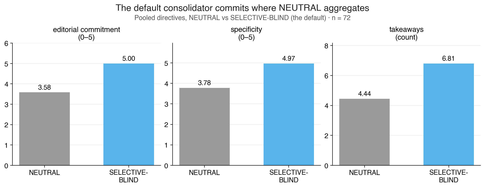

***Figure 5. The default consolidator commits where NEUTRAL aggregates.**
Pooled-scope directive means — one consolidation over all 20 readers per story —
for NEUTRAL (grey) vs the default SELECTIVE-BLIND (light blue) on three coded
dimensions; n = 36 directives each, 0–5 scales except takeaways (a count). The
default sits at the commitment ceiling (5.00 vs NEUTRAL's 3.58) and produces
more, more specific, takeaways. This is the editorial-selection machinery
working as designed — and with no CRAFT_GUIDE vocabulary involved; the fourth
coded dimension, craft vocab, is the rubric-leak metric and is shown separately
in Fig. 8–9.*

The headline differentiation is on **conflict resolution**:

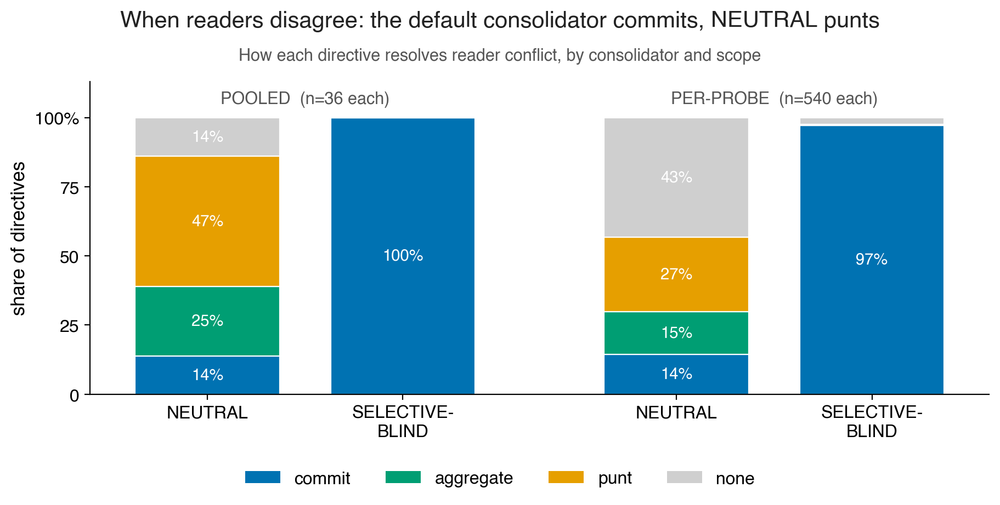

***Figure 6. When readers disagree, the default commits; NEUTRAL punts.** Share
of directives by how they resolve reader conflict — commit to one side (blue),
aggregate both (green), punt the decision to the writer (orange), or not engage
(grey) — for NEUTRAL vs the default, at pooled (n = 36 each) and per-probe
(n = 540 each) scope. NEUTRAL commits only 14% of the time and punts roughly
half; the default commits 100% (pooled) / 97% (per-probe). This
conflict-resolution split is the single sharpest separator of the two
consolidators (χ² across the three variants: pooled 86.96, per-probe 688.10;
p < 0.0002).*

| (scope × variant) | commit | aggregate | punt | none |
|---|---:|---:|---:|---:|
| pooled NEUTRAL (n=36) | 14% | 25% | **47%** | 14% |
| pooled SELECTIVE-BLIND (n=36) | **100%** | 0 | 0 | 0 |
| per-probe NEUTRAL (n=540) | 14% | 15% | 27% | **43%** |
| per-probe SELECTIVE-BLIND (n=540) | **97%** | 0 | 0 | 2% |

Consolidator × resolution: pooled χ² = 86.96 (df = 6), per-probe χ² = 688.10
(df = 3), p < 0.0002 across the three variants.

NEUTRAL **does not commit** in the canonical sense — under pooled scope it
punts the choice to the writer 47% of the time, aggregates competing views
25%, and only commits 14%. The default SELECTIVE-BLIND commits 100% (pooled) /
97% (per-probe). This editorial-commitment machinery is exactly what the
senior-editor prompt is engineered to produce, and it is fully realized —
**without any CRAFT_GUIDE vocabulary** (the reason BLIND, not SELECTIVE, is the
default; see §3.5).

Attribution rates tell the same story:

| (scope × variant) | reader_attribution | probe_attribution | conflict_acknowledged |
|---|---:|---:|---:|
| pooled NEUTRAL | 17% | 36% | 86% |
| pooled SELECTIVE-BLIND | **100%** | **100%** | **100%** |
| per-probe NEUTRAL | 18% | 19% | 57% |
| per-probe SELECTIVE-BLIND | **100%** | 83% | 98% |

The default consistently tags specific reader slots ("A:0", "B:1") and
specific probes when explaining its edits. NEUTRAL mostly doesn't.

### 3.4 Pooling strategy modulates directive size, not direction

Within the per-probe scope, the **arm** (A-only / B-only / AB-joint) controls
how many readers feed in. We expected wider input to either produce richer
directives (more takeaways) or wash out commitment (regress to aggregation).

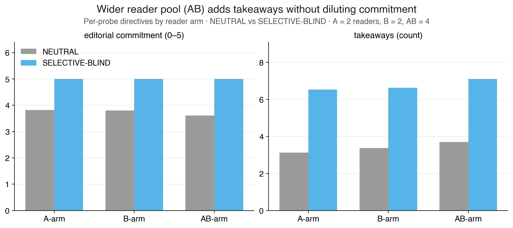

***Figure 7. A wider reader pool adds material without diluting commitment.**
Per-probe directive means by reader arm — A-only (2 readers), B-only (2),
AB-joint (4) — for NEUTRAL (grey) vs the default SELECTIVE-BLIND (light blue),
across all 5 probes × 36 stories. Feeding more readers (AB) lifts the takeaway
count under both consolidators, but the default's editorial commitment stays
pinned at 5.00 across every arm (NEUTRAL instead drifts down, 3.82 → 3.61). The
committing editor absorbs a wider, noisier pool without regressing to
fence-sitting.*

| variant | arm | editorial commit | takeaways | specificity |
|---|---|---:|---:|---:|
| neutral | A | 3.82 | 3.13 | 3.18 |
| neutral | B | 3.81 | 3.37 | 3.14 |
| neutral | **AB** | 3.61 | 3.69 | 3.32 |
| SELECTIVE-BLIND | A | 5.00 | 6.53 | 4.79 |
| SELECTIVE-BLIND | B | 5.00 | 6.63 | 4.76 |
| SELECTIVE-BLIND | **AB** | 5.00 | **7.11** | 4.84 |

AB-joint (more readers) → more takeaways under both variants. **Commitment is
unmoved by arm size under the default** (all 5.00) but dips slightly under
NEUTRAL (3.82 → 3.61). The committing editor absorbs reader disagreement
without losing its commit posture; NEUTRAL doesn't.

### 3.5 Rubric-leak quantified and contained

This is the methodological cleanup we owe `REPORT_V3_WRITER_JUDGE.md`. The
SELECTIVE consolidator's prompt names CRAFT_GUIDE vocabulary explicitly. The
judge's prompt also embeds CRAFT_GUIDE. If both share the rubric, the
judge may be rewarding vocabulary alignment, not actual editorial quality.

SELECTIVE-BLIND was built by stripping all 8 CRAFT_GUIDE terms (counterfactual
discipline, implication over exposition, period voice without anachronism,
earned compression, specificity over abstraction, sentence-level necessity)
from the prompt while keeping the editorial machinery (name axes, pick a side,
refuse the other) intact.

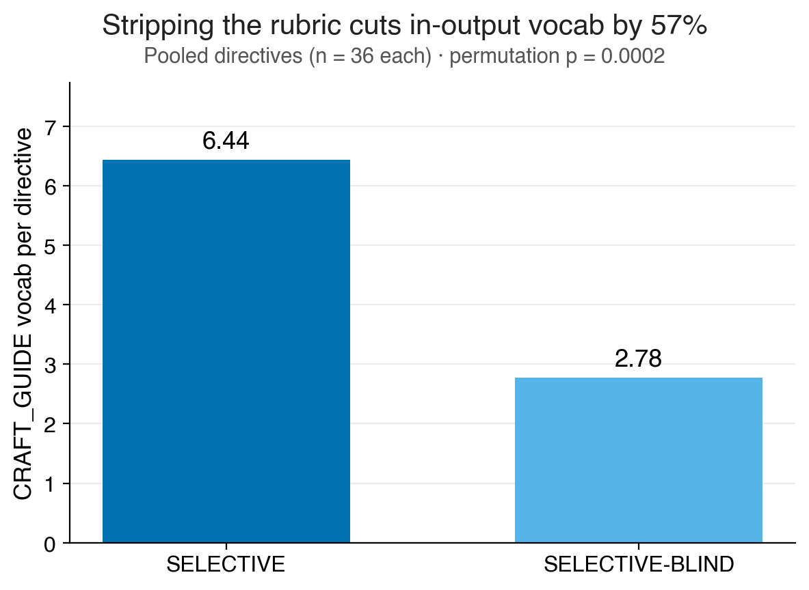

***Figure 8. Stripping the rubric removes the shared vocabulary (pooled).** Mean
count of CRAFT_GUIDE-aligned terms per directive for plain SELECTIVE (whose
prompt names those craft values) vs SELECTIVE-BLIND (identical machinery, the
vocabulary removed); n = 36 each, pooled scope. Removing the rubric from the
prompt cuts in-output rubric vocabulary by 57% (6.44 → 2.78, permutation
p = 0.0002). That term overlap is what could let a CRAFT_GUIDE-primed judge
reward SELECTIVE for matching its words rather than for better editing — the
reason BLIND, not SELECTIVE, is the default everywhere else in this report.*

| variant | pooled craft_vocab mean | gap vs SELECTIVE | p |
|---|---:|---:|---:|
| SELECTIVE | 6.44 |  — |  — |
| SELECTIVE-BLIND | 2.78 | -3.67 | 0.0002 |
| NEUTRAL | 1.25 | -5.19 | 0.0002 |

**Stripping the rubric works.** SELECTIVE-BLIND uses 57% less CRAFT_GUIDE
vocab than SELECTIVE (and it doesn't drop to 0 because some CRAFT_GUIDE terms
— "specificity", "compression" — are reachable from generic editorial
reasoning). But on all *other* directive dimensions (commitment, specificity,
takeaway count, conflict-resolution mix, attribution rates) SELECTIVE-BLIND
matches SELECTIVE within noise. **The mechanism is editorial commitment, not
shared rubric vocabulary.** This is the cleanest methodological finding in
this session.

**The leak control now holds at per-probe scope too.** The check above was
pooled-only (36 vs 36 directives). We extended SELECTIVE-BLIND to all five
probes and all three arms (540 blind directives via `revise_byprobe_blind_v3.py`)
and re-ran the comparison against the 540 per-probe SELECTIVE directives. The
result is the same — and sharper:

| dim (per-probe, n=540 vs 540) | SELECTIVE | SELECTIVE-BLIND | gap | p |
|---|---:|---:|---:|---:|
| craft_vocab_count | 5.92 | 1.12 | **-4.80** | 0.0002 |
| editorial_commitment | 5.00 | 5.00 | -0.00 | 1.0 |
| specificity | 4.76 | 4.80 | +0.04 | 0.22 |
| takeaway_count | 6.65 | 6.76 | +0.10 | 0.37 |

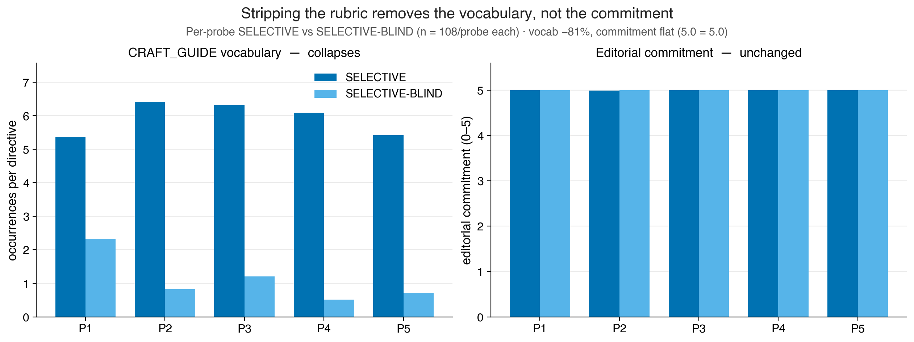

***Figure 9. The leak is vocabulary; the commitment is real — at probe
resolution.** Per-probe SELECTIVE vs SELECTIVE-BLIND, n = 108 per probe each.
Left: CRAFT_GUIDE vocabulary collapses when the rubric is stripped (−81% overall,
even larger than the pooled −57% in Fig. 8) — and on every individual probe.
Right: editorial commitment is unchanged (5.0 = 5.0 on all five probes);
specificity and takeaway count are likewise flat (n.s.). So what naming the
rubric in the prompt adds is its* words*, not the editor's willingness to take a
side — the effect that matters survives the strip on every probe.*

Stripping the rubric removes **81%** of the craft vocabulary per-probe (vs 57%
pooled — the per-probe SELECTIVE prompt leans harder on the rubric, so it has
more to lose) while commitment, specificity, and takeaway count are unmoved.
The pattern replicates on **every individual probe** (craft_vocab gaps +3.0 to
+5.6, all p=0.0002; commitment exactly 5.00 in all five; specificity and
takeaways n.s. on all but a marginal P5 specificity, +0.19, p=0.02 *toward*
blind). Per-probe conflict resolution confirms it: SELECTIVE-BLIND commits
**97%** of the time, SELECTIVE 94%, NEUTRAL 14%. The leak is vocabulary; the
commitment is real, at probe resolution.
(Source: `directive_aggregates/rubric_leak_perprobe.csv`.)

### 3.6 The probe and the variant drive *what kind* of edit (edit_emphasis)

`edit_emphasis` — whether a directive mostly cuts, expands, shifts voice, or
restructures — was coded for all 1,728 directives but never aggregated until
now. It adds a directive-layer parallel to the C1 finding that probes drive
*attention*: the probe (and the NEUTRAL-vs-default contrast) also drives *the
kind of revision pushed*.

By consolidator (per-probe scope; across the three variants chi²=156.9,
df=10, p=0.0002):

| variant (n=540) | cut | expand | voice_shift | mixed |
|---|---:|---:|---:|---:|
| NEUTRAL | 5% | **11%** | 15% | 67% |
| **SELECTIVE-BLIND** (default) | **19%** | 3% | 9% | 68% |

Committing means **cutting**: the default pushes "cut" ~4× as often as NEUTRAL
(19% vs 5%) and rarely asks the writer to expand (3% vs 11%). The neutral
synthesizer *adds*; the committing editor *compresses*. (Pooled directives are
~92% "mixed" regardless of variant — n.s., chi²=4.8, p=0.38 — because a
whole-cell consolidation touches everything.)

By probe, under the default consolidator (chi²=179.1, df=20, p=0.0002):

| probe (n=108) | cut | expand | voice_shift | mixed |
|---|---:|---:|---:|---:|
| P1 Plausibility | 4% | 0% | **22%** | 71% |
| P2 Knowledge-gap | **35%** | 0% | 2% | 63% |
| P3 Stability | **42%** | 0% | **18%** | 41% |
| P4 Convention | 3% | 8% | 5% | 84% |
| P5 Salience | 11% | 6% | 0% | 83% |

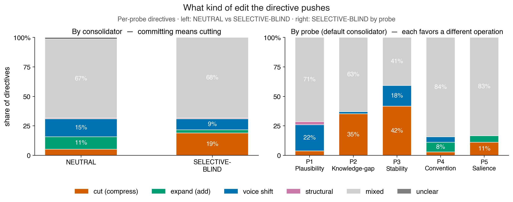

***Figure 10. What kind of edit the directive pushes.** Share of per-probe
directives by primary edit operation: cut/compress (vermillion), expand/add
(green), voice-shift (blue), structural (purple), mixed (grey), unclear. Left —
NEUTRAL vs the default: **committing means cutting**, the default pushes "cut"
~4× as often as NEUTRAL (19% vs 5%) and rarely asks the writer to expand (the
neutral synthesizer adds; the committing editor compresses). Right — under the
default, each probe favours a different operation: P1 → voice fixes, P2 →
cutting, **P3 Stability is the most surgical** (42% cut + 18% voice-shift), P4 →
diffuse "mixed." The probe→differentiation logic of Fig. 1–2, now visible in the*
output *directives (χ²: by-consolidator 156.9 across variants; by-probe 179.1;
both p = 0.0002).*

The edit type tracks the probe's semantics: P1 (anachronism) → voice fixes;
P2 (over-explanation) → cutting; **P3 Stability (writing calls attention to
itself) → the most surgical of all** (42% cut + 18% voice_shift, only 41%
mixed — readers point at intrusions, the editor excises them); P4 (genre) →
diffuse "mixed." This is the same probe→differentiation logic as C1, now
visible in the *output* directives, not just the reader inputs.

### 3.7 Validity check: the default's commitment is grounded, not invented

A skeptic's worry about the committing editor: maybe its extra commitment and
longer takeaway lists are the consolidator *fabricating* edits no reader
raised. We coded an **invention rate** for every directive — feeding the coder
both the reader notes and the directive, and asking what fraction of the
directive's moves trace to no reader (`code_directive_extras.py`).

| invention_rate (share of moves with no reader basis) | NEUTRAL | SELECTIVE-BLIND (default) |
|---|---:|---:|
| pooled (n=36) | 0.135 | 0.164 |
| per-probe (n=540) | 0.070 | 0.108 |

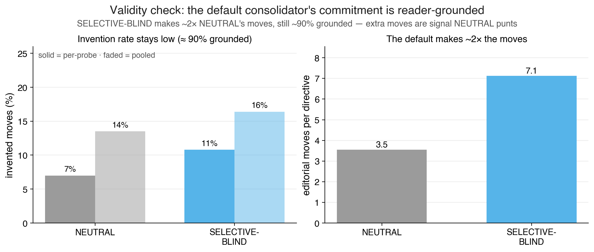

***Figure 11. The default's commitment is reader-grounded, not invented.** A
validity check that codes each directive against the reader notes it was built
from. Left: the invention rate — the share of a directive's moves that trace to*
no *reader — stays low for both consolidators (solid bars = per-probe, faded =
pooled); the default invents only ~11% of its moves per-probe, barely above
NEUTRAL's 7%. Right: the default makes ~2× the moves (7.1 vs 3.5 per directive).
So the default's extra commitment is grounded reader signal that NEUTRAL left as
punts, not fabrication — the complement to the rubric-leak check (Fig. 8–9):
SELECTIVE-BLIND's substance is both committed and reader-grounded.*

Invention is **low everywhere (7–16%)**: ~90% of the default's moves are
grounded in real reader observations. SELECTIVE-BLIND invents only marginally
more than NEUTRAL (per-probe gap +0.038, p=0.0002 — statistically detectable,
negligible in size). Critically, the default makes **~7.1 moves per directive
to NEUTRAL's ~3.5** while inventing only ~0.8 of them: the extra moves are
overwhelmingly *grounded reader signal that NEUTRAL left on the table*
(punted), not editorial fiction. Together with §3.5 this is a two-sided
validity result — the rubric *vocabulary* leaked (which is why BLIND, not
SELECTIVE, is the default), but the default's *substance* is both committed
(§3.3) and reader-grounded (here). (Source:
`directive_aggregates/invention_by_variant.csv`.)

### 3.8 Which craft camp the editor takes — and a partial answer to §4.4

We also coded, per directive, **which craft priority it sides with** when it
commits: `period` (historical accuracy, period voice, material grounding —
A-reader style), `generic` (pacing, tension, structure, genre beats —
B-reader style), `balanced`, or `none`.

(Plain SELECTIVE appears in this section — unlike the BLIND-default framing used
elsewhere — because both the rubric-tilt below and the §4.4 B-wins result it
addresses are SELECTIVE-specific.)

By variant (per-probe, chi²=211, df=6, p=0.0002):

| variant (n=540) | period | generic | balanced | none |
|---|---:|---:|---:|---:|
| NEUTRAL | 16% | 24% | 56% | 5% |
| SELECTIVE | **48%** | 24% | 28% | 0% |
| SELECTIVE-BLIND | 29% | **35%** | 36% | 0% |

Two things. (a) SELECTIVE commits to **period** 3× as often as NEUTRAL — when
the editor picks a side, it tends to be the historical-craft side. (b) The
rubric doesn't only add vocabulary, it *tilts the side*: stripping it (BLIND)
shifts the editor away from period (48%→29%) toward generic (24%→35%). So
CRAFT_GUIDE has a second, subtler effect beyond the leak measured in §3.5 — it
biases *which* camp wins, not just the words used to describe it.

This speaks to the open **§4.4** puzzle (B-group feedback produced stronger
SELECTIVE revisions; mechanism unknown). One hypothesis was "B readers push
the directive toward generic craft, which generalizes better." The camp-by-arm
breakdown **rules that out**:

| SELECTIVE, by arm (n=180) | period | generic | balanced |
|---|---:|---:|---:|
| A-only | 42% | 27% | 31% |
| B-only | **49%** | 25% | 26% |
| AB-joint | 52% | 20% | 28% |

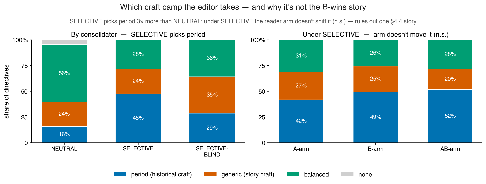

***Figure 12. Which craft camp the editor takes — and why it doesn't explain the
B-wins result.** Share of per-probe directives by the craft priority sided with:
period / historical craft (blue), generic / story craft (vermillion), balanced
(green), none (grey). Left (all three consolidators, n = 540 each): plain
SELECTIVE picks the period side 3× more than NEUTRAL, and stripping the rubric
(BLIND) shifts the editor toward generic — so CRAFT_GUIDE biases* which *side
wins, not just the vocabulary. Right (under SELECTIVE, by reader arm, n = 180
each): the arm does **not** significantly move the camp (χ² = 5.1, p = 0.28), and
B-fed directives side period as much as A-fed — ruling out "B pushes the editor
toward generic craft" as the mechanism behind B's stronger SELECTIVE revisions
(§4.4). (SELECTIVE appears here, unlike elsewhere, because both effects are
SELECTIVE-specific.)*

Under SELECTIVE, the arm does **not** change the camp (chi²=5.1, p=0.28, n.s.),
and B-informed directives side *period* slightly **more** than A-informed, not
less. So B's downstream advantage is **not** the consolidator siding generic
when fed B readers — it must live elsewhere (clearer/less-hedged B signal, or
a writer/judge-layer effect). Under NEUTRAL the arm does matter a little
(chi²=14.8, p=0.02; B leans generic, AB leans balanced), but NEUTRAL rarely
commits anyway. (Source: `directive_aggregates/camp_by_variant.csv`,
`camp_by_arm.csv`.)

### 3.9 Headline picture across both coding sweeps

| Layer | What V3 shows (with significance) |
|---|---|
| Reader pipeline | Probe identity explains 11–32% of attention variance; **probes differentiate**. |
| Reader pipeline | A vs B differentiation is concentrated in P3 / P5 → **HF-reader disposition leaks through "control" probes**. |
| Consolidator | NEUTRAL **punts** ~half the time; the default (SELECTIVE-BLIND) **commits** ~100%. |
| Consolidator | The default consistently attributes moves to specific readers and probes; NEUTRAL doesn't. |
| Consolidator | Rubric leak (SELECTIVE vs BLIND) quantified at −57% craft vocab (pooled), **−81% per-probe**; commitment survives at both scopes → BLIND is the default. |
| Consolidator | **Probe drives edit type**: P3 Stability → cut+voice_shift (surgical); committing (the default) means cutting, not expanding. |
| Consolidator | **Validity**: ~90% of the default's moves are reader-grounded (invention ~10%, barely above NEUTRAL) — commitment is real, not fabricated. |
| Consolidator | **Camp (§4.4)**: SELECTIVE sides *period* 3× more than NEUTRAL; the rubric tilts the side (BLIND shifts toward generic). B-arm does **not** push generic → rules out one §4.4 hypothesis. |
| Pooling | AB-joint produces more takeaways than A-only/B-only; the default absorbs the wider pool without losing commitment. |

These are all derivable from the coding pipeline alone, **without invoking
the LLM writer or LLM judge.** That is the key methodological point of this
report: the V3 reader/consolidator system produces *differentiated and
attributable* editorial signals that are visible at the coding layer.
Whether those signals produce better stories is a separate question.

---

## 4. What we don't have

### 4.1 No external measure of revision quality

We have the writer/judge harness (see `REPORT_V3_WRITER_JUDGE.md`) showing
SELECTIVE > NEUTRAL ~64% on the LLM judge, SELECTIVE-BLIND tracking SELECTIVE,
and B-group feedback producing stronger revisions than A-group on 4/5 probes.
**Those are LLM-judge results. We have no external calibration.**

Concretely:
- The judge is given a 20-marker CRAFT_GUIDE rubric. That rubric is our
  intuition about good historical fiction. We wrote it. The SELECTIVE
  consolidator also references it. Even after the BLIND control, both ends
  of the pipeline share a worldview.
- No human evaluation panel scored these stories.
- No downstream task (editor accept-rate, real-reader rating, anthology
  inclusion) anchors the judge's preferences.
- The Hoyt-and-Rachel human coding sheets (`coding/scores_*.csv`) use a
  different scheme (M1–M5 markers) and only cover 12 of the 36 stories at
  first-round level. They are a starting point, not a calibration set.

This is a known limit. It's labeled here because the next phase needs to
target it directly (§5.1).

### 4.2 Known artifacts in the revision dataset

The compiled `revisions_dataset/` has 1,764 .md files (36 originals + 1,728
revisions). Three quality flags survived QA (one per-probe blind revision was
truncated on the first sweep and retried to full length, so it carries no flag):

| story | config | issue |
|---|---|---|
| cell-05-middle-sp-pure__run3 | P3_B_selective | writer refused (Chinese-language decline) |
| cell-05-middle-sp-pure__run3 | P3_AB_neutral | writer refused (same) |
| cell-10-distant-sp-fantastical | P3_AB_neutral | hit writer max_tokens=8000 (~6,000 words) |

The 2 refusals were not noticed at sweep time because the runner's status
check only verifies the file was written, not its content. The directive
files for those arms exist and look normal. Recoverable with a writer rerun.

Note that **the analyses in this report do not use the revised stories.** C1
codes only readers; C2 codes only directives. The revision dataset is shipped
as an artifact for downstream analysis (e.g., the human-rater pilot proposed
in §5.1), but no statistic in §3 depends on the writer's output.

### 4.3 Probe rewrite flattened some V2 signals

`REPORT_V3.md` reported that the V3 probe rewrites collapsed V2's headline
A-B gap on Plausibility (V2: -0.8, V3: -0.2) and on Convention (V2 was the
V2 headline separator; V3 it shrank from 4.7 → 1.1). The "controls" P3 and
P5 then leaked the most. This means V3 in its current form has a different
signal structure than V2; we have not decided whether to (a) treat V3's
signal structure as the finding ("HF disposition leaks through unintended
channels") or (b) restore V2's prime language on P1/P4 while keeping P5
as a control. **Both paths are open and uncosted.**

### 4.4 B-group wins under SELECTIVE — mechanism unknown

`REPORT_V3_WRITER_JUDGE.md` reports that under SELECTIVE consolidation,
B-group (control / low-HF) readers produce stronger revisions than A-group
on 4 of 5 probes (per-probe A_vs_B head-to-head: B=92, A=78, ties=2). The
only probe where A wins is P3 Stability.

We don't have a mechanistic explanation. Plausible stories:
- ~~B readers notice more *generic-genre* issues, which generalize across
  probes; A readers notice more *period-specific* issues, which only matter
  for one probe.~~ **Tested this session and rejected** (§3.8): the craft camp
  a SELECTIVE directive takes does not depend on the arm (chi²=5.1, p=0.28),
  and B-informed SELECTIVE directives side *period* slightly more than
  A-informed (49% vs 42%), not generic. The consolidator does not "go generic"
  when fed B readers, so B's advantage is not carried by the directive's craft
  side.
- B readers are more direct (less hedging, fewer caveats), giving the
  consolidator clearer signal. **Still open** — would need a coding of reader
  directness/hedging.
- SELECTIVE's "spread over depth" effect favors the wider attention pattern
  of B over A's narrower period focus. **Still open.**
- A new candidate, since the directive-layer camp is ruled out: the effect may
  live at the **writer/judge layer** rather than in the directive — e.g. the
  judge (CRAFT_GUIDE-primed) responding to something in B-informed revisions
  that the directive coding doesn't capture.

The first hypothesis is now closed; the rest remain testable but untested.

### 4.5 Single-judge bottleneck

Everything in V3 — reader, consolidator, writer, judge, coder — is
deepseek-v4-flash on OpenRouter. Inter-model variance is unmeasured. The
writer/judge result *might* not replicate on Claude or GPT-5.2.

---

## 5. What we need next

Each ask below pairs a question we can't answer now with a concrete resource
estimate. Quantities are rough; the goal is to make the trade-offs visible.

### 5.1 Human-rater panel to anchor revision quality (the central ask)

**Question we can't answer:** is "judge prefers SELECTIVE 64%" tracking real
quality, or is it tracking shared rubric vocabulary that survived the BLIND
control in vocab but not in commitment?

**Pilot scope:**
- 36 stories × 6 revisions per story (original + pooled NEUTRAL + pooled
  SELECTIVE-BLIND + 2 per-probe SELECTIVE-BLIND picks + 1 plain SELECTIVE, kept
  so humans can independently check the leak control) = 216 revisions to rate.
- 6 raters (mix of MFA students + HF readers from Goodreads recruitment).
  Each rater sees ~36 pairwise comparisons (per-story original-vs-revision
  + selective-vs-blind + pooled-vs-best-per-probe).
- ~5 minutes per pair → 3h / rater → 18 rater-hours.
- Codebook calibration: 1 day with Hoyt + Rachel to harmonize their M1–M5
  scheme with the LLM coder's dimensions.
- Inter-rater κ on a 36-pair calibration set before the main task.

**Cost estimate:**
- Rater stipends: $25/h × 18h × 6 raters ≈ $2,700.
- Platform (Prolific or local + Qualtrics): $500.
- 1 RA-week for sheet construction + analysis ($1,500–$2,500).
- **Total: ~$5,000–$6,000** for one calibrated pilot.

**What this unlocks:** a κ between LLM-judge and humans; a calibration set
for the SELECTIVE-vs-NEUTRAL claim; an external anchor for downstream V4
choices.

### 5.2 Multi-judge replication

**Question:** does the writer/judge result generalize across models?

**Scope:** replicate the writer/judge harness with at least:
- Claude Opus 4.7 as judge (deepseek as writer + readers)
- GPT-5.2 as judge
- Optionally Llama 4 as a non-frontier judge

**Cost estimate:**
- Judge calls are ~700 per sweep × 3 judges = ~2,100 calls
- Mid-context judge calls on Opus/GPT-5.2 are ~$0.10–0.30 each: **$200–$600 in API spend**
- ~3 person-days for harness adaptation + analysis

**What this unlocks:** confidence that the 64% SELECTIVE win is not
deepseek-judge-specific; a way to detect rubric leak that survives even the
BLIND prompt (if two independent judges agree the leak control works).

### 5.3 Larger persona pool

**Question:** is the B-wins-4-of-5 per-probe result stable, or a small-n
artifact at n=10 personas / group?

**Scope:**
- Recruit (algorithmically) 20 personas/group instead of 10 (current).
- Re-run reader passes for the new 20 personas across all 36 stories × 5
  probes = 20 × 36 × 5 × 2 = 7,200 new pass-1 + pass-2 reader passes.
- Re-run consolidator + writer downstream where it matters.

**Cost estimate:**
- ~7,200 reader pass-2 calls + 7,200 pass-1, then maybe 14,400 codings.
  At deepseek-v4-flash rates: **~$50–80 in API spend**.
- ~1 person-week to refresh the persona-build pipeline + groups.py to pull
  the larger sample from Goodreads (need to verify the underlying parquet
  still has enough matched-confound users).

**What this unlocks:** 80% power on the A-vs-B differentiation we currently
report; the ability to compute cell-axis × persona × probe interactions
(currently underpowered).

### 5.4 Restore V2 probe priming on P1 and P4 (probe redesign)

**Question:** was V3's flatten on P1/P4 a real finding ("HF disposition
leaks through unintended channels"), or a V3 probe-rewrite artifact?

**Scope:**
- A/B test: V3 probe text vs. restored V2 prime language for P1 and P4 only.
- Keep P5 as the control. Re-run readers + codings on the new probes for
  all 36 stories.
- Compare A-B gap structure.

**Cost estimate:**
- Reader passes on revised P1/P4: 36 × 2 × 2 × 2 = 288 new reader passes
  (×2 for the variant). Negligible API cost (<$10).
- ~1 person-week for probes.py edits + analysis.

**What this unlocks:** a decision on whether to roll V3's signal structure
into V4 or revert.

### 5.5 Aggregate ask

| Item | $ | Person-time | Unlocks |
|---|---:|---:|---|
| 5.1 Human-rater pilot | $5,000–6,000 | 2 RA-weeks + 1 grad-student week | External quality anchor — the core missing piece |
| 5.2 Multi-judge replication | $200–600 | 3 person-days | Cross-model robustness of writer/judge claims |
| 5.3 Larger persona pool | $50–80 | 1 person-week | 80% power on A-vs-B; cell-axis interactions |
| 5.4 Probe redesign A/B | <$10 | 1 person-week | V3 vs V2 probe-structure decision |
| **Total** | **~$5,300–6,700** | **~5–6 person-weeks** | The next phase has external calibration, model robustness, and statistical power |

The dominant cost is **the human-rater pilot.** Everything else fits in the
existing infrastructure with negligible additional compute.

---

## 6. Artifact index

All artifacts in this report live under
`experiments_v3/run_20260531-022438/`:

| Path | Description |
|---|---|
| `meta.json` | Run-level config (36 stories, 2 groups × 10 personas, seed=17) |
| `stories/<story_id>/story.txt` | Original story (1 per story_id) |
| `results/<group>/<story_id>/<probe>/agent-<slot>/{pass1,pass2}.txt` | Reader responses |
| `results/.../coding.json` | Reader-attention coding (now 720/720 clean after this session) |
| `revisions_dataset/<story_id>/<config>.md` | **Compiled revision dataset** (1,764 files, 36 originals + 1,728 revisions; 49/story). See README. |
| `revisions_dataset/manifest.csv` | Manifest with all config metadata + 3 word-count quality flags |
| `revisions_dataset/README.md` | Dataset documentation |
| `directive_codings/<scope>/<story_id>/<config>.json` | Per-directive 10-dim coding (1,728 files) |
| `directive_codings/manifest.csv` | Directive codings manifest |
| `directive_extras_codings/<scope>/<story_id>/...` | Relational codings: invention rate + craft camp (this session, 1,728 files) |
| `directive_extras_codings/manifest.csv` | Extras codings manifest |
| `aggregated_differentiation/*.csv` | C1 reader-coding tables (probe × group × dim, A-B gap, convention chi²) |
| `aggregated_differentiation/summary.json` | C1 JSON summary with eta² and p-values |
| `directive_aggregates/*.csv` | C2 directive tables (variant means, pairwise diffs, resolution mix, `rubric_leak_perprobe.csv`, `edit_emphasis_*.csv`, `invention_*.csv`, `camp_*.csv`) |
| `directive_aggregates/summary.json` | C2 JSON summary (pooled + per-probe rubric-leak, invention headline) |
| `../report_v3/REPORT_V3.md` | Reader-side findings (prior report) |
| `../report_v3/REPORT_V3_WRITER_JUDGE.md` | Writer/judge harness findings (prior report) |
| `../report_v3/REPORT_V3_INTERMEDIATE.md` | This report |
| `../report_v3/figures_intermediate/*.png` | 12 figures (4 C1, 8 C2), 200 dpi |

Scripts that produced this report (all in `experiments_v3/`):

| Script | What it does |
|---|---|
| `compile_revisions_dataset.py` | Builds `revisions_dataset/` (49/story) from all sweeps' outputs; word-count quality flags |
| `revise_byprobe_blind_v3.py` | **NEW**: per-probe SELECTIVE-BLIND sweep (5 probes × 3 arms × 36 = 540 directives + revisions) |
| `extend_coding_coverage.py` | Re-codes parse-error stubs + fills missing slots → 720/720 clean |
| `analyze_v3_differentiation.py` | C1: probe × group × dim aggregations + permutation tests |
| `code_directives.py` | C2: LLM-codes 1,728 directives on 10 dimensions |
| `code_directive_extras.py` | **NEW**: relational coding — invention rate + craft camp, each directive vs its reader inputs |
| `analyze_directives.py` | C2: aggregates directive + extras codings; per-probe rubric-leak, edit_emphasis, invention, camp |
| `make_intermediate_figures.py` | Generates the 9 C1/C2 figures (needs zhu-env python for matplotlib) |

---

*Document version: 2026-06-07. Pipeline run: 2026-05-31 (`run_20260531-022438`).
This report's coding extensions + analyses + figures were produced 2026-06-07.
Per-probe SELECTIVE-BLIND extension, relational codings (invention + camp), and
the §3.6–3.8 analyses were added 2026-06-07 in a follow-up session.*
